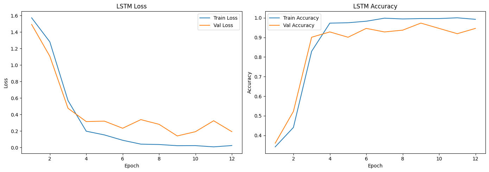
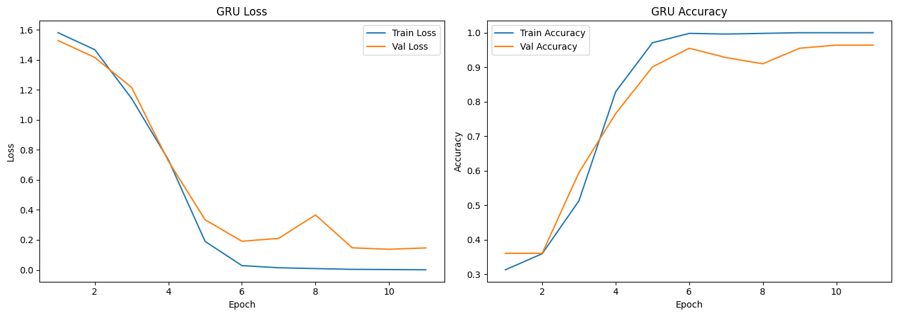

# 📰 BBC Sports Text Classification  
### Bidirectional LSTM vs GRU for Multi-Class News Categorization

## 📑 Table of Contents

- [About The Project](#-about-the-project)
- [Dependencies](#-dependencies)
- [Dataset](#-dataset)
- [Data Preprocessing Pipeline](#-data-preprocessing-pipeline)
- [Model Architectures](#-model-architectures)
- [Experiments](#-experiments)
- [Results & Performance Comparison](#-results--performance-comparison)
- [Installation & Setup](#-installation--setup)
- [Author](#-author)
- [License](#-license)

## 📌 About The Project

This project implements a multi-class text classification system on the BBC Sport dataset using deep learning architectures.

The primary objectives are:

- Compare Bidirectional LSTM (BiLSTM) and Bidirectional GRU (BiGRU) models  
- Evaluate classification performance  
- Measure training time and RAM consumption
- Study the impact of input sequence length on accuracy and computational efficiency  

The focus is on both predictive performance and computational efficiency.

## 🗂 Dependencies


## 📊 Dataset 
 
The dataset used in this project is the BBC News / BBC Sport text dataset collected from the following public repository:

- **Source:** [bbc-fulltext dataset](https://github.com/derekgreene/bbc-datasets)

All credit for the dataset belongs to the original authors/providers. This repository uses the dataset for educational and research purposes only.

This dataset consists of sports news articles from the BBC. There are a total of 737 documents in 5 sports classes:
 - Football
- Cricket
- Rugby
- Tennis
- Athletics

Each document contains a text file associated with the class. Due to the structure being in different folders, the code section is given first that reads the text files in each class folder, converts it into a data frame, and saves it in a .csv file. The data frame structure consists of columns **[label, file name, text]** that aggregate the information from all the datasets in this file, and the rest of the code uses the same .csv file.

## 🔎 Data Preprocessing Pipeline

### 1️⃣ Text Cleaning

- Lowercasing
- Removing punctuation and non-alphabetic characters (using `re`)
- Removing stopwords (`nltk.corpus.stopwords`)

### 2️⃣ Tokenization
```python
Tokenizer(num_words=10000, oov_token="<OOV>")

- Vocabulary size: **10,000 words**
- OOV handling enabled
```

### 3️⃣ Sequence Length Strategy

Sequence length determined statistically:

- Median length → Short input
- 95th percentile → Medium input (main experiment)
- 99th percentile → Long input

In order to achieve proper results, text length is chosen to be 95th percentile of the token distribution.

### 4️⃣ Reproducibility
```python
random.seed(42)
np.random.seed(42)
tf.random.set_seed(42)
```
## 🧠 Model Architectures

Two architectures are examined for this project:
- GRU
- LSTM

The proposed RNN models are suitable for multi-class text classification in this project.</br></br>
LSTM networks are an improved version of RNNs designed to solve the vanishing gradient problem. They use memory cells that keep information over longer periods. And GRUs are a simplified version of LSTMs, they combine the input and forget gates into a single update gate helps in reducing the number of parameters and making the model less computationally demanding. 

<p align="center">
  
</p>

<p align="center">
  <em>Model Architectures</em>
</p>

Thus the GRU model is expected to lead to better results. Models have common structures as much as possible.

LSTM model is the modified version of the model in the following public repository:

- **Source:** [LSTM-MultiClass-Classification](https://github.com/Aakkash24/LSTM-MultiClass-Classification)

All credit for the dataset belongs to the original authors/providers. This repository uses the dataset for educational and research purposes only.

### 🔹 Bidirectional LSTM (BiLSTM)
Embedding(128)
→ SpatialDropout1D(0.2)
→ Bidirectional(LSTM(64))
→ Dense(64, activation='relu')
→ Dense(5, activation='softmax')

- Loss: Categorical Crossentropy  
- Optimizer: Adam  

### 🔹 Bidirectional GRU (BiGRU)
Embedding(128)
→ SpatialDropout1D(0.2)
→ Bidirectional(GRU(128))
→ Dense(64, activation='relu')
→ Dense(5, activation='softmax')

## 🧪 Experiments

###  Experiment 1: LSTM vs GRU

Metrics evaluated:

- Training Accuracy
- Validation Accuracy
- Training Time (seconds)
- RAM Usage (MB) via `psutil`

### Experiment 2: Effect of Input Sequence Length

| Configuration | Sequence Length |
|---------------|-----------------|
| Short         | Median length   |
| Medium        | 95th percentile |
| Long          | 99th percentile |

Objective:

- Analyze trade-off between:
  - Accuracy
  - Training time
  - Memory consumption


## 📈 Results & Performance Comparison

### 🔹 Model Comparison

<p align="center">
  
</p>

<p align="center">
  <em>Loss and Accuracy of LSTM Model</em>
</p>

<p align="center">
  
</p>

<p align="center">
  <em>Loss and Accuracy of GRU Model</em>
</p>

The result plots show that both BiLSTM and BiGRU achieved strong performance on the BBC Sport multi-class classification task. BiLSTM provided slightly higher and more stable validation accuracy in some experiments, while BiGRU reached comparable results with faster training time and lower memory usage. 

Overall, the plots suggest that BiLSTM is a strong choice when maximizing accuracy is the main goal, whereas BiGRU offers a better trade-off between performance and computational efficiency.

| Model  | Validation Accuracy | Training Time(s) | MAX Training RAM Usage(MB) |
|--------|---------------------|------------------|-----------|
| BiLSTM | 0.972               |17.253            |1480.793|
| BiGRU  | 0.963               |12.560            |1528.410|

</br>

**Key Observations:**

- GRU achieved similar accuracy to LSTM.
- GRU trained faster.
- GRU consumed slightly less memory.


### 🔹 Input Length Study

- Short sequences → Faster training, slight accuracy drop  
- Medium (95%) → Best performance-efficiency tradeoff 
- Long (99%) → Minimal accuracy gain, higher cost  

The image below shows training time and input length for the three mentioned lengths.

<p align="center">
  
</p>

<p align="center">
  <em>Training Time and Test Accuracy for Chosen Lengths</em>
</p>

| Length Type | Length | Validation Accuracy | Validation Loss |Training Time(s)|
|-------------|--------|---------------------|-----------------|-------------|
| short       | 170    | 0.829               |0.409|13.208|
| medium      | 391    | 0.946               |0.142|12.753|
| long        | 551    | 0.874               |0.269|10.850|

**Conclusion:**  
The 95th percentile sequence length offers the best balance.


## 💻 Installation & Setup

### 1️⃣ Clone Repository

bash
git clone (https://github.com/Yasaman-Khouri/BBC_Sports_Classification_LSTM_GRU.git)
cd BBC_Sports_Classification_LSTM_GRU

### 2️⃣ Create Virtual Environment

```bash
python -m venv venv
source venv/bin/activate   # Linux/Mac
venv\Scripts\activate      # Windows
```

### 3️⃣ Install Dependencies

```bash
pip install -r requirements.txt
```

### 4️⃣ Download NLTK Resources

```python
import nltk
nltk.download('stopwords')
```
## 👤 Author
### **Yasaman Khouri**   

### GitHub: https://github.com/Yasaman-Khouri 

### Email : jsmnkhouri@gmail.com

## 📃 License
This project code is licensed under the MIT License.

**The dataset used in this project belongs to its original providers and is subject to its own license and usage terms.**


